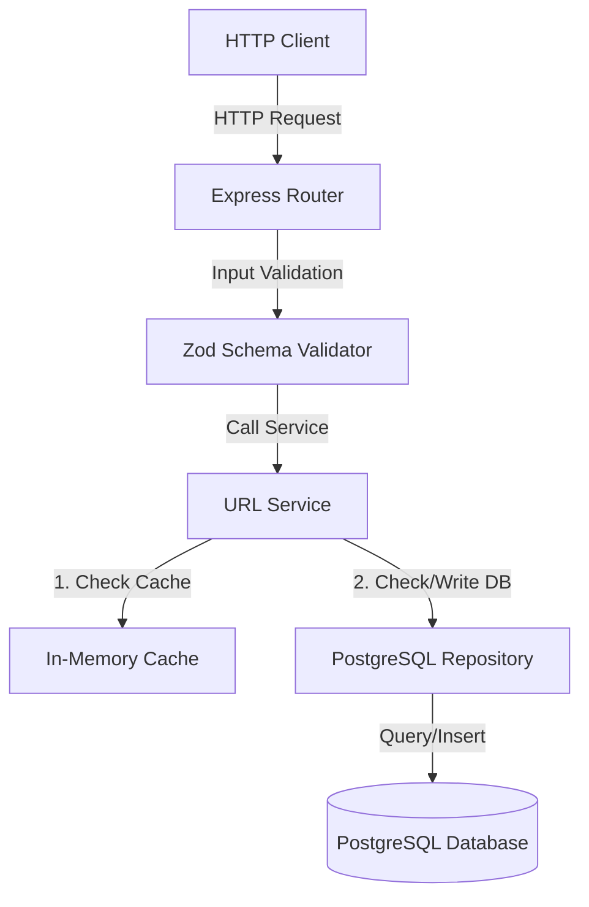

# 🔗 Base62 URL Shortener Service

An enterprise-grade, high-performance URL shortener service built with **Bun**, **TypeScript**, **Express**, and **PostgreSQL**. Designed with clean architecture, strict schemas, in-memory caching, and a cryptographically secure random shortcode generation engine.

---

## 🏗️ Architecture & Component Design

The codebase strictly adheres to **Dependency Injection (DI)** and **Separation of Concerns**, ensuring testability, clean boundaries, and easy extensibility.



### Folder Structure
```bash
src/
├── Router/                # Route definitions & dependency injection wrappers
│   ├── docs.router.ts     # Swagger / OpenAPI documentation rendering
│   └── url.router.ts      # URL shortening and redirect resolution routes
├── __tests__/             # Comprehensive test suites using Bun Test runner
├── cache/                 # Cache interface and memory storage implementation
├── config/                # Environment configuration loader with Zod validation
├── constants/             # Global limits, TTLs, and configuration values
├── docs/                  # OpenAPI / Swagger definition document
├── middleware/            # Request interceptors (Zod body/params parsing, global error)
├── repository/            # PostgreSQL data access layer (raw queries via pg Pool)
├── schema/                # Zod schemas for payload validation
├── service/               # Core business logic handlers (shorten & resolve workflows)
├── utils/                 # General helpers (AppError, URL normalizers, generators)
└── index.ts               # Application bootstrapper
```

---

## ⚡ Core Shortening Engine: "Random Rocks + Ask Chief"

For shortcode generation, this service utilizes a stateless, cryptographically secure random Base62 mapper. 

### Why Base62?
Standard Base64 contains `+`, `/`, or padding characters (`=`), which are not URL-safe and require URL-encoding. Base62 restricts the alphabet to `[0-9][a-z][A-Z]`, ensuring all shortened paths are highly readable and safe for copy-pasting anywhere.

### Algorithm Flow
1. **Entropy Collection:** We extract $8$ random bytes via Node's cryptographically secure pseudo-random number generator (`crypto.randomBytes()`).
2. **Modulo Selection:** Each byte is mapped to our 62-character alphabet using `byte % 62`.
3. **Database Guard:** The service verifies uniqueness by performing an index-backed check on PostgreSQL before inserting:
   - If a collision occurs, it regenerates a new code (re-rolling up to 5 times).

```ts
// src/utils/url.ts
const BASE62 = "0123456789abcdefghijklmnopqrstuvwxyzABCDEFGHIJKLMNOPQRSTUVWXYZ"

export const generateShortCode = (): string => {
  const bytes = randomBytes(SHORT_CODE_LENGTH)
  let code = ""
  for (let i = 0; i < SHORT_CODE_LENGTH; i++) {
    code += BASE62[bytes[i] % 62]
  }
  return code
}
```

### Collision Math
- Total search space: $62^8 \approx 218\text{ trillion}$ combinations.
- If $N = 1,000,000$ active links exist, the likelihood of a collision on generation is only $\approx 0.00000045\%$.
- The $5$-attempt retry loop provides absolute safety while retaining speed and scalability.

---

## 💾 Database Schema

The database table `url_shortener` is defined via Prisma and matches the raw queries used by the repository layer.

```prisma
model UrlShortner {
  id            BigInt       @id @default(autoincrement())
  shortCode     String       @map("short_code") @db.VarChar(8)
  originalUrl   String       @map("original_url") @db.Text
  isCustomAlias Boolean      @default(false) @map("is_custom_alias")
  createdAt     DateTime     @default(now()) @map("created_at")
  updatedAt     DateTime     @default(now()) @updatedAt @map("updated_at")
  deletedAt     DateTime?    @map("deleted_at")

  @@unique([shortCode])
  @@unique([originalUrl])
  @@map("url_shortener")
}
```

---

## 🚦 API Reference

### 1. Shorten a URL
Creates a shortened version of a given HTTP/HTTPS URL. Optionally accepts a custom 8-character alias.

* **URL:** `/shorten`
* **Method:** `POST`
* **Headers:** `Content-Type: application/json`
* **Request Body:**
  ```json
  {
    "url": "https://example.com/some/long/path/document",
    "alias": "docalias" // Optional: Must be exactly 8 characters [a-zA-Z0-9_-]
  }
  ```
* **Success Response (201 Created):**
  ```json
  {
    "data": {
      "originalUrl": "https://example.com/some/long/path/document",
      "shortCode": "docalias",
      "shortUrl": "http://localhost:8080/docalias"
    }
  }
  ```

### 2. Redirect/Resolve URL
Resolves a shortcode and redirects the client to the original URL.

* **URL:** `/:shortId`
* **Method:** `GET`
* **Success Response (302 Found):** Redirects to the resolved destination.
* **Error Response (404 Not Found):**
  ```json
  {
    "status": "fail",
    "message": "short url not found"
  }
  ```

### 3. Service Health Check
* **URL:** `/health`
* **Method:** `GET`
* **Response (200 OK):**
  ```json
  {
    "status": "Healthy",
    "timestamp": "2026-07-18T16:07:21.000Z"
  }
  ```

### 4. Interactive Swagger Documentation
Open the interactive Swagger UI panel directly in your browser:
* **URL:** [http://localhost:8080/docs/](http://localhost:8080/docs/)
* **Raw Spec:** [http://localhost:8080/docs/openapi.json](http://localhost:8080/docs/openapi.json)

---

## ⚙️ Environment Configuration

Copy the sample environment variables or configure them directly in your shell:

| Variable | Description | Default |
|---|---|---|
| `PORT` | Local port the HTTP server listens on | `8080` |
| `NODE_ENV` | Running mode environment (`dev` or `production`) | `'dev'` |
| `DATABASE_URL` | PostgreSQL connection string | *Required* |
| `BASE_URL` | Output short url prefix | `http://localhost:${PORT}` |
| `REDIS_URL` | Redis connection URL | `redis://localhost:6379` |

---

## 🚀 Running the Project

### Prerequisites
Make sure you have [Bun](https://bun.sh/) and [Docker](https://www.docker.com/) installed.

### 1. Spin up Database & Redis Containers
```bash
docker compose up -d
```

### 2. Run Database Migrations
Deploy the database schema to your local PostgreSQL container using Prisma:
```bash
bunx prisma db push
```

### 3. Start Development Server
```bash
bun run dev
```
The server will start on [http://localhost:8080](http://localhost:8080).

### 4. Run Test Suite
Run unit, integration, and mock tests with full speed:
```bash
bun test
```
